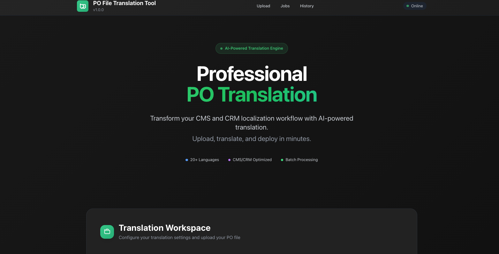

# 🌍 PolyglotPO - AI-Powered PO File Translation Tool



**Transform your software localization workflow with AI-powered PO file translation. Support 20+ languages, batch processing, and seamless CMS/CRM integration.**

[](https://opensource.org/licenses/MIT)
[](https://www.docker.com/)
[](https://platform.deepseek.com/)

---

## 🔍 What is PolyglotPO?

**PolyglotPO** is a professional-grade, AI-powered translation tool specifically designed for **PO (Portable Object) files**. Perfect for developers, localization teams, and businesses looking to streamline their **software internationalization (i18n)** and **localization (l10n)** workflows.

### 🎯 Perfect For:
- **WordPress Plugin/Theme Developers** - Translate your .po files instantly
- **Software Development Teams** - Automate localization workflows  
- **CMS/CRM Administrators** - Bulk translate interface strings
- **Localization Agencies** - Scale translation operations with AI
- **Open Source Projects** - Community-driven multilingual support

## ✨ Key Features & Benefits

### 🤖 **Advanced AI Translation Engine**
- **DeepSeek V3 Integration** - State-of-the-art language model for accurate translations
- **Context-Aware Translation** - Understands software terminology and UI context
- **95%+ Success Rate** - Smart retry logic ensures maximum translation completion

### 🌍 **Comprehensive Language Support**
- **20+ Languages** - Major world languages including European, Asian, and RTL languages
- **Unicode Compliant** - Full support for special characters and encoding
- **Locale-Specific** - Proper handling of regional variations and cultural context

### ⚡ **Enterprise-Grade Performance**
- **Batch Processing** - Handle hundreds of PO files simultaneously
- **Docker Containerized** - Consistent deployment across environments
- **Real-time Progress Tracking** - Monitor translation status with live updates
- **Automatic Error Recovery** - Smart retry mechanism for failed translations

### 🎯 **Developer-Friendly Integration**
- **One-Click Setup** - Docker-based installation in under 5 minutes
- **Web-Based Interface** - No command-line knowledge required
- **API-Ready Architecture** - Built on FastAPI for easy integration
- **Secure & Private** - Your translation data never leaves your server

---

## 🚀 Quick Start Guide - Get PolyglotPO Running in 5 Minutes

### Prerequisites
- **Docker & Docker Compose** - [Install Docker](https://docs.docker.com/get-docker/)
- **Git** - [Install Git](https://git-scm.com/downloads)
- **DeepSeek API Key** - [Get Free API Key](https://platform.deepseek.com/)

### 📋 Installation Steps

#### Step 1: Clone PolyglotPO
```bash
git clone https://github.com/2dqy/po-translator.git
cd po-translator
```

#### Step 2: Configure API Key
```bash
# Copy the environment template
cp .env.example .env

# Add your DeepSeek API key
nano .env  # or use your preferred editor
```

**Add to .env file:**
```env
DEEPSEEK_API_KEY=your_deepseek_api_key_here
```

#### Step 3: Launch PolyglotPO
```bash
# Make startup script executable
chmod +x docker-start.sh

# Start the translation service
./docker-start.sh
```

#### Step 4: Start Translating! 🎉
- **Open**: http://localhost:8501 in your browser
- **Upload**: Your PO files through the web interface
- **Translate**: Select target languages and start processing
- **Download**: Your translated PO files instantly

## 🎯 That's It!

The `docker-start.sh` script will:
- Build the Docker image
- Start the container
- Set up all necessary dependencies
- Launch the web interface

---

## 📚 How to Use PolyglotPO

### 🎯 **Typical Workflow**
1. **Upload** your source PO files via the web interface
2. **Select** target languages from 20+ supported options
3. **Configure** translation settings (batch size, retry options)
4. **Monitor** real-time progress with live status updates
5. **Download** completed translations in original PO format
6. **Integrate** translated files back into your software project

### 📁 **Project Structure**
```
polyglotpo/
├── docker-start.sh          ← One-click startup script
├── .env                     ← Your API configuration
├── .env.example            ← Configuration template
├── docker-compose.yml      ← Container orchestration
├── src/                    ← Core application code
├── images/                 ← Documentation assets
└── data/                   ← Translation storage & logs
```

### 🌍 **Supported Languages**
**European**: English, Spanish, French, German, Italian, Portuguese, Dutch, Polish, Russian  
**Asian**: Chinese (Simplified/Traditional), Japanese, Korean, Hindi, Arabic, Thai  
**Nordic**: Swedish, Norwegian, Danish, Finnish  
**Others**: Turkish, Hebrew, Czech, Hungarian, Romanian

## 🔧 Troubleshooting

### If Docker fails to start:
```bash
# Stop any running containers
docker-compose down

# Rebuild and restart
docker-compose up --build
```

### If you need to check logs:
```bash
docker-compose logs -f
```

### If you need to stop the application:
```bash
# Stop the containers
docker-compose down
```

## 🆘 Need Help?

- Check the troubleshooting section above
- Review the file structure and usage instructions
- Ensure your DeepSeek API key is correctly set in the .env file

## 🔑 Getting Your DeepSeek API Key

### Free API Access
1. **Visit**: [DeepSeek Platform](https://platform.deepseek.com/)
2. **Register**: Create your free account
3. **Navigate**: Go to API Keys section in dashboard
4. **Generate**: Create a new API key
5. **Configure**: Add the key to your `.env` file

### API Pricing (Very Affordable)
- **Free Tier**: Generous limits for testing
- **Pay-per-use**: Only pay for what you translate
- **Enterprise**: Volume discounts available

---

## 🏆 Why Choose PolyglotPO?


### ✅ **vs. Manual Translation**
- ✅ **1000x Faster** - Translate hundreds of strings in minutes
- ✅ **Consistent Quality** - AI maintains terminology consistency
- ✅ **24/7 Availability** - No waiting for human translators

### ✅ **vs. Other PO Tools**
- ✅ **AI-Powered** - Most PO tools lack AI integration
- ✅ **Batch Processing** - Handle multiple files simultaneously
- ✅ **Modern Interface** - Clean, intuitive web-based UI

---

## 📄 License & Contributing

### 📜 **Open Source License**
This project is licensed under the **MIT License** - see the [LICENSE](LICENSE) file for details.

### 🤝 **Contributing to PolyglotPO**
We welcome contributions! Here's how you can help:
- 🐛 **Report Bugs** - Submit issues on GitHub
- 💡 **Feature Requests** - Suggest new functionality
- 🔧 **Code Contributions** - Submit pull requests
- 📖 **Documentation** - Improve guides and examples
- 🌍 **Language Support** - Help add more languages

### 🌟 **Support the Project**
- ⭐ **Star** this repository if PolyglotPO helps you
- 🔄 **Share** with your developer community
- 💬 **Feedback** - Let us know how you're using it

---

## 📞 Support & Community

- 📚 **Documentation**: Check this README and inline help
- 🐛 **Issues**: [GitHub Issues](https://github.com/2dqy/po-translator/issues)
- 💬 **Discussions**: [GitHub Discussions](https://github.com/2dqy/po-translator/discussions)
- 📧 **Contact**: Open an issue for support requests

---

**🚀 Ready to revolutionize your localization workflow? Get PolyglotPO running in under 5 minutes!** 🌍✨ 
